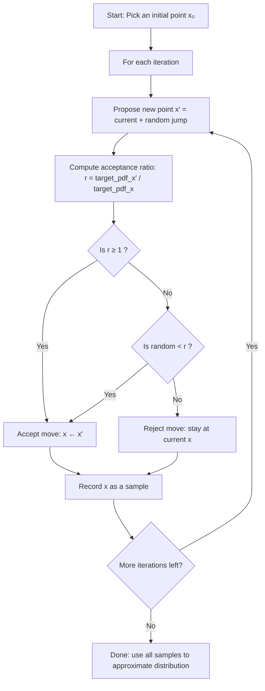

# Introduction
In this project we utilized Gibbs Sampling method to identify motifs and create a position frequency matrix (PFM). A sequence was randomly selected and a motif within the sequence was subsequently selected. The PFM was created from the 
remaining sequences and then used to build the Position Weight Matrix (PWM). The PWM was then utilized for scoring. This process is repeated several times to identify the most common motifs in a series of genetic sequences that may pose some biological importance.

# Pseudocode
```
GibbsMotifFinder function(seqs, k, seed=42)
    randomly select a k-mer in each sequence greater than 0 
    Add the k-mer to list/dictionary of motifs
    Iterate through the sequences several times to select random
    Build PFM without the sequence with motif
    Convert PFM to PWM
    Score K-mers
    convert scores into probabilites
    sample new motifs based on probabilities
    when convergence occurs, return the final PFM
```

# Successes
One of our successes was overcoming our difference in schedules to complete the assignment. Understanding the Gibbs Sampling method was tricky at first but after some self studying we managed to get a grasp on how the method works.

# Struggles
- **Strand directionality complexity**: Implementing the scoring for forward and reverse complement strands required careful thinking through molecular biology principles- that I kept second guessing myself on.

- **Asynchronous collaboration**: Coordinating schedules proved difficult, especially when the group leader was ill for a week. Working asynchronously meant delayed feedback loops and difficulty debugging together in real-time. We had to rely heavily on detailed comments and commit messages to communicate our progress and questions.

- **Unequal workload distribution due to illness**: When one team member is sick, the remaining members must either take on additional work or wait for recovery, both of which impact project momentum and team dynamics.

- **Understanding MCMC conceptually**: Grasping how random sampling can lead to optimal solutions was initially counterintuitive. The probabilistic selection choosing k-mers based on weighted scores rather than always picking the best, which I am not sure led to the correct graph,but we do have a graph


# Personal Reflections
## Group Leader (Nikaela Aitken)
This project was particularly challenging because I was sick for a week during the critical implementation phase, which made staying on top of the concepts and debugging much harder than usual.

To build my understanding of MCMC methods, I relied heavily on video resources:

- [StatQuest: Markov Chain Monte Carlo (MCMC)](https://www.youtube.com/watch?v=7LB1VHp4tLE) - This video helped me understand the fundamental concepts of sampling from distributions and why random walks can find optimal solutions.

- [Gibbs Sampling Explained](https://www.youtube.com/watch?v=MNHIbOqH3sk) - This specifically clarified how Gibbs sampling updates one variable at a time while holding others constant, which is exactly what happens when we exclude one motif and rebuild the PWM.

I also used ChatGPT extensively to discuss MCMC concepts and created the following visualization to understand the acceptance/rejection process:

## Other member (Allen Benavidez)
When beginning this project, my initial obstacle was being able to understand
what Gibbs sampling does. Though I understood its purpose, I had trouble following
how the math works out and why each step during the process matters. After 
taking some time to study I understood it enough to where I could begin the 
project. There were obstacles during writing the code but through collaboration
I was able understand how Gibbs Sampling process could be written with code.

# Generative AI Appendix
As per the syllabus
